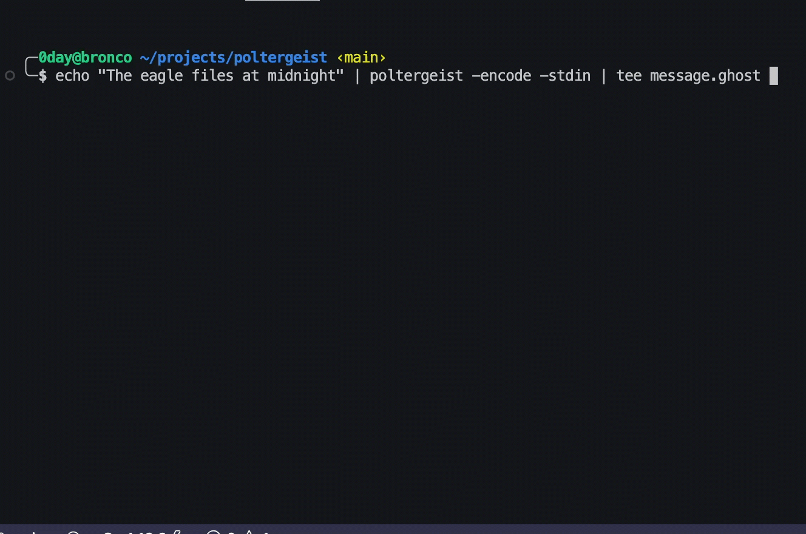

# poltergeist 👻

There are 26 unique whitespace characters supported in unicode. This is enough to represent every latin letter as whitespace, but to make this PoC more robust we instead use the 16 characters used in hexadecimal.

This tool can be used to encode and decode text as whitespace. This can be useful for steganography or creating unreadable text.

## Install 

`go install github.com/shell-company/poltergeist/cmd/poltergeist@latest   `

## Usage

To encode:

`./poltergeist -encode -file <input_file>`

OR 

` <script> | ./poltergeist -encode -stdin`

To decode:

`./poltergeist -decode -file <input_file> -stdin`

OR

` <script> | ./poltergeist -decode -stdin`

## Flags

-encode: Encode text as whitespace
-decode: Decode text from whitespace
-file: Specify an input file. If stdin is specified, this flag is ignored.
-stdin: Read from stdin.
-test: Print the table of whitespace characters to see how your shell interprets them

## Example

To encode the text "Hello world":

`./poltergeist -encode -file input.txt`

To decode the text:

`./poltergeist -decode -file output.txt`

## Character table

The following table shows the 26 unique whitespace characters and their descriptions

| character | description |
| --------- | ---------- |
|`\u0009` | CHARACTER TABULATION |
|`\u000A` | LINE FEED (LF) |
|`\u000B` | LINE TABULATION |
|`\u000C` | FORM FEED (FF) |
|`\u000D` | CARRIAGE RETURN (CR) |
|`\u0020` | SPACE |
|`\u0085` | NEXT LINE (NEL) |
|`\u00A0` | NO-BREAK SPACE |
|`\u1680` | OGHAM SPACE MARK |
|`\u2000` | EN QUAD |
|`\u2001` | EM QUAD |
|`\u2002` | EN SPACE |
|`\u2003` | EM SPACE |
|`\u2004` | THREE-PER-EM SPACE |
|`\u2005` | FOUR-PER-EM SPACE |
|`\u2006` | SIX-PER-EM SPACE |
|`\u2007` | FIGURE SPACE |
|`\u2008` | PUNCTUATION SPACE |
|`\u2009` | THIN SPACE |
|`\u200A` | HAIR SPACE |
|`\u2028` | LINE SEPARATOR |
|`\u2029` | PARAGRAPH SEPARATOR |
|`\u202F` | NARROW NO-BREAK SPACE |
|`\u205F` | MEDIUM MATHEMATICAL SPACE |
|`\u3000` | IDEOGRAPHIC SPACE |
|`\uFEFF` | ZERO WIDTH NO-BREAK SPACE |

## To-Do
```
       …         …   
 …        …       	   …            …	
```
